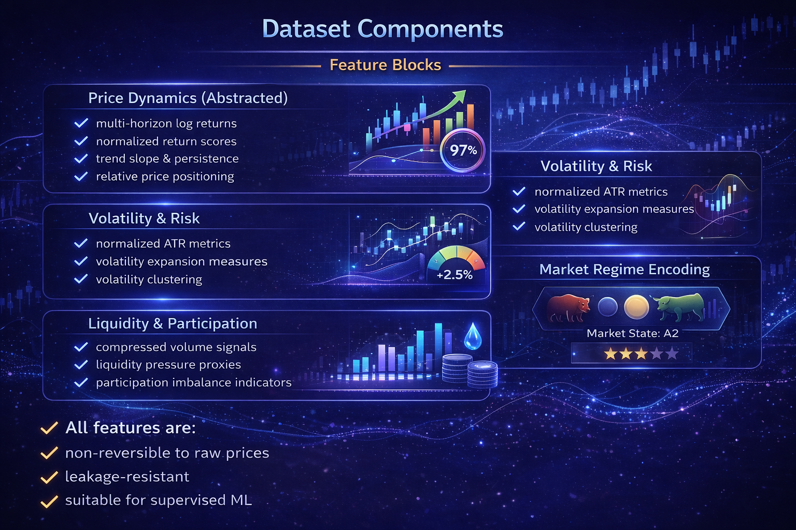
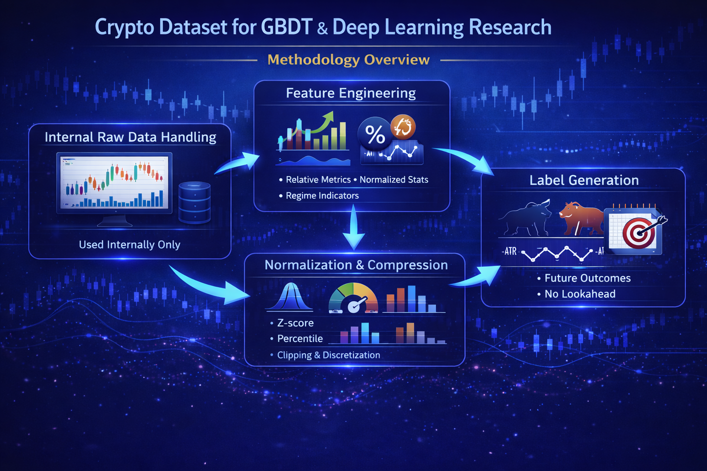

# Crypto ML Feature & Outcome Dataset
### Market Intelligence for Systematic Trading & Machine Learning

---

## Executive Summary

This project provides a **commercial-grade crypto market dataset** designed
specifically for **machine learning, quantitative research, and systematic trading**.

Unlike raw exchange data feeds, this dataset delivers:
- **engineered market features**
- **forward-looking outcome labels**
- **regime-aware abstractions**

All without distributing raw OHLCV or exchange-native data.

This makes the dataset:
- safer to license and redistribute
- more useful for ML modeling
- aligned with professional research standards

---

## Product Positioning

This dataset is **not a data feed**  
and **not a trading strategy**.

It is a **research-grade market abstraction layer** that sits between:
- raw exchange data vendors, and
- end-user trading systems.

We focus on **structure, signal integrity, and usability**, not data volume.

---

## Key Differentiators

### 1. No Raw OHLCV Distribution
- No open, high, low, close, or raw volume columns
- No exchange-identifiable price series
- No risk of raw data redistribution issues

### 2. Machine-Learning–First Design
- Feature normalization and compression
- Scale-invariant representations
- Tree-friendly encodings (GBDT-optimized)

### 3. Outcome-Oriented Labels
- ATR-based TP/SL outcomes
- Risk–reward expectations
- Drawdown-aware classification

### 4. Regime Awareness
- Trend regime
- Volatility regime
- Composite market state encoding

---

## Dataset Components

### Feature Blocks

**Price Dynamics (Abstracted)**
- multi-horizon log returns
- normalized return scores
- trend slope & persistence
- relative price positioning

**Volatility & Risk**
- normalized ATR metrics
- volatility expansion measures
- volatility clustering

**Liquidity & Participation**
- compressed volume signals
- liquidity pressure proxies
- participation imbalance indicators

**Market Regime Encoding**
- trend regime (bear / neutral / bull)
- volatility regime (low / medium / high)
- composite market state ID

All features are:
- non-reversible to raw prices
- leakage-resistant
- suitable for supervised ML

---

### Label Blocks

Labels are generated using **strict forward-looking logic**:

- future return bins
- ATR-based TP/SL hit indicators
- expected risk–reward
- drawdown risk class

Labeling is designed to support:
- walk-forward validation
- purged cross-validation
- regime-aware evaluation

---

## Methodology Overview

### 1. Internal Raw Data Handling
Raw OHLCV data is used **internally only** for computation and labeling.

It is **never included** in deliverables.

---

### 2. Feature Engineering
Raw price and volume information is transformed into:
- relative measures
- normalized statistics
- regime-sensitive indicators

This removes:
- absolute price dependency
- scale instability
- exchange-specific artifacts

---

### 3. Normalization & Compression
All continuous features are:
- normalized (z-score, percentile, or ratio-based)
- clipped to control outliers
- optionally discretized for tree models

---

### 4. Regime Detection
Market conditions are classified using:
- trend persistence
- volatility clustering
- risk pressure indicators

Regime labels are **causal**, not hindsight-based.

---

### 5. Label Generation
Future outcomes are computed using:
- volatility-adjusted horizons
- ATR-based thresholds
- strict no-lookahead rules

No future information leaks into features.

---

## Intended Use Cases

- ML-based trading research
- Strategy selection & regime switching
- Risk-aware position sizing
- Feature benchmarking for GBDT models
- Quantitative experimentation without raw data licensing complexity

---

## Target Users

This product is designed for:
- systematic traders
- quant researchers
- ML engineers working with financial time series
- small funds & independent research desks

It is **not** designed for:
- discretionary trading
- signal-following services
- retail indicator usage

---

## Delivery Format

- CSV or Parquet
- documented schema
- feature definitions
- labeling methodology overview
- sample usage notes

---

## Commercial Access

Datasets are provided per:
- asset class or symbol group
- timeframe
- feature & label configuration

Pricing reflects:
- research depth
- preprocessing complexity
- labeling rigor

For samples, schema previews, or licensing inquiries,
please contact the project owner directly.

---

## Disclaimer

This product is provided for **research and educational purposes only**.

It does not constitute:
- investment advice
- trading recommendations
- financial solicitation

All users are responsible for their own application and risk management.

---

## Closing Note

In quantitative trading,  
**data structure matters more than model choice**.

This dataset exists to provide that structure.
